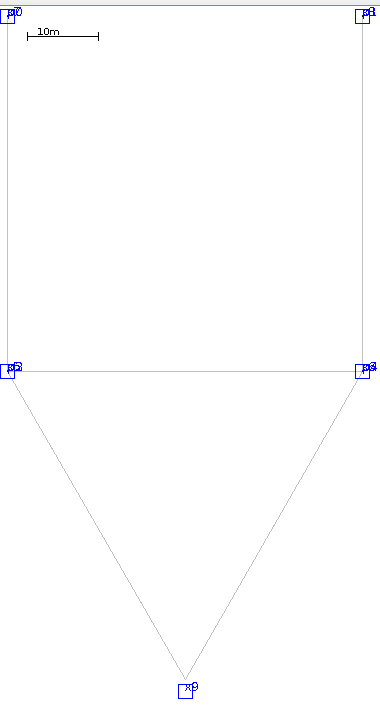
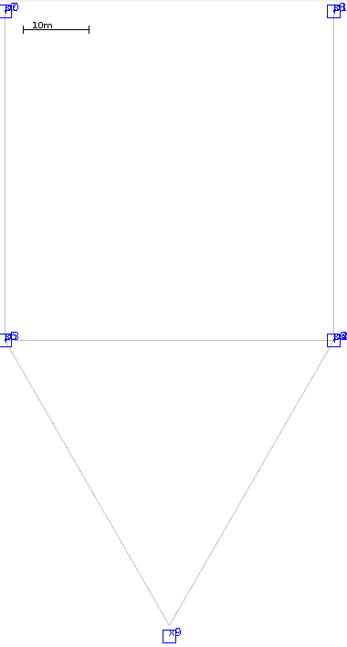
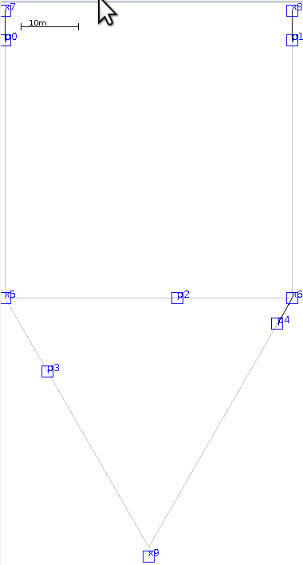

# Adaptive routing for DTN

---

### Somewhere on earth

- Foto of the cel transactions
- argue that this technology helped them, how much would help really access to internet?

---

### Connection based Internet limitations

---

### DTN - Store and Forward

---

### DTN - Use Cases examples

---

### Context in DTN

- Stochastic
- Probabilistic
- Deterministic

---

### Stochastic example

---

### Probabilistic example

---

### Deterministic example

---

### Simplified contexts
<ul class="list-unstyled list-inline text-center">
  <li>
    
    <figcaption>Stochastic</figcaption>
  </li>
  <li>
    
    <figcaption>Probabilistic</figcaption>
  </li>
  <li>
  
  <figcaption>Deterministic</figcaption>
  </li>
</ul>

---

### Choosing the right routing algorithm

- Epidemic
- Probabilistic
- Deterministic (CGR)
- Hybrid

---

### Epidemic

- Foto of epidemic movement

---

### CGR

---

### Prophet

---

### Every algo has a context in which it nails it.

---

### What about context changes?

---

